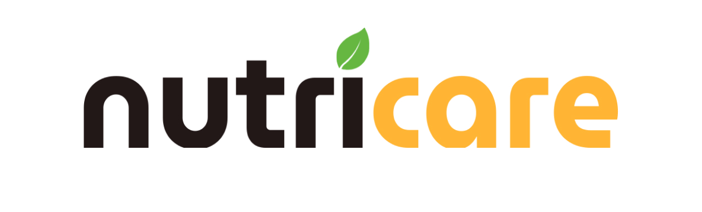

# NutriCare v2

    

  Versi terbaru dari proyek <strong>NutriCare</strong>, dikembangkan dengan teknologi modern untuk mendukung kesejahteraan penduduk.

## 🌟 Tentang Proyek

**NutriCare v2** adalah kelanjutan dari proyek [NutriCare](https://github.com/beryllwithcode/project-NutriCare), sebuah capstone project SIB x Dicoding Batch 5 yang berhasil meraih penghargaan **Best Capstone Project** dengan tema **Kesejahteraan Penduduk**.  

Proyek ini bertujuan untuk:  
- Meningkatkan fitur yang sudah ada pada versi sebelumnya.  
- Memberikan solusi inovatif untuk mendukung kesejahteraan masyarakat, terutama di bidang nutrisi dan kesehatan.

Pengembangan proyek dilakukan oleh satu developer dengan memanfaatkan dasar dari versi sebelumnya.

---

## 🚀 Teknologi yang Digunakan

Proyek ini dibangun menggunakan stack teknologi modern berikut:  
- **[Next.js](https://nextjs.org/)** - Framework React untuk pengembangan web.
- **[shadcn-ui](https://shadcn.dev/)** - Komponen UI modern yang dapat disesuaikan.
- **[Auth.js](https://authjs.dev/)** - Solusi autentikasi untuk aplikasi web.
- **[Prisma](https://www.prisma.io/)** - ORM yang fleksibel untuk mengelola database.
- **[Neon](https://neon.tech/)** - Platform database PostgreSQL berbasis cloud.

> Catatan: Proyek ini masih dalam tahap pengembangan. Teknologi lain mungkin akan ditambahkan di masa mendatang.

---

## 📌 Status Proyek

Proyek ini masih **dalam tahap pengembangan aktif**. Pembaruan akan diumumkan secara berkala.  

Jika Anda tertarik untuk melihat perkembangan lebih lanjut, silakan pantau repository ini.  

---

## 🤝 Kontribusi

Saat ini proyek dikembangkan secara mandiri.  
Namun, jika Anda memiliki ide, saran, atau ingin berkontribusi, silakan:  
1. Buka **Issues** untuk berdiskusi.  
2. Kirimkan **Pull Request** jika ingin menambahkan fitur atau memperbaiki bug.

---

## 📄 Lisensi

Proyek ini menggunakan lisensi [MIT](LICENSE). Anda bebas menggunakan, mengubah, dan mendistribusikan proyek ini sesuai ketentuan lisensi.

---

Dibuat dengan ❤️ oleh [bersianturi](https://github.com/bersianturi)
